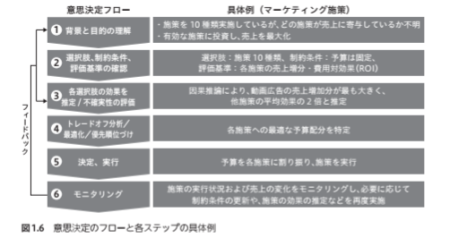

- 因果推論 - 基礎から機械学習・時系列分析・因果探索を用いた意思決定のアプローチ
- コードは[こちら](https://note.com/tak1/n/n8fa31d4c8038)から引用

## 1. 因果の探求から社会実装

### 因果とは

- 因果を含む真理を追求するための科学的アプローチには3段階がある
    - ブラーエ(データ収集)
    - ケプラー(法則化)
    - ニュートン(真理発見)
- 意思決定フロー(因果推論を行う場合の本書におけるフロー)

## 2. 因果推論の基礎